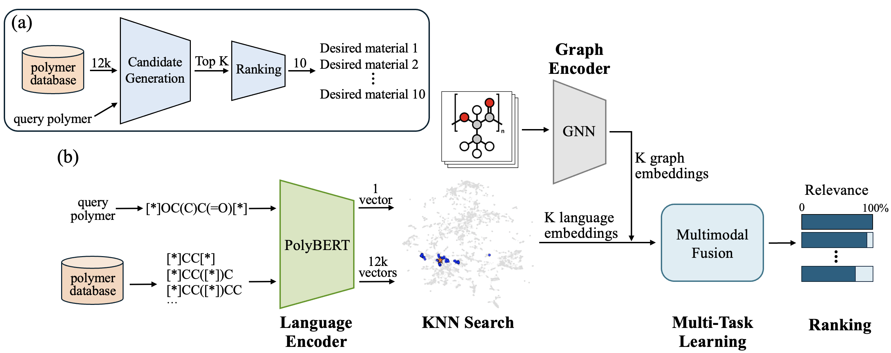

# PolyRecommender

A multimodal recommendation system for polymer discovery. Accepted at **NeurIPS 2025 AI4Mat**.

## Overview



**Figure**: Overview of the PolyRecommender system. (a) The recommendation pipeline: given a query polymer, the system first retrieves top K candidates and then ranks them by relevance. (b) The multimodal architecture: Language Encoder (PolyBERT) learns from SMILES representations; Graph Encoder (GNN) learns from molecular graphs; KNN-based FAISS search recalls top K candidates; the Multimodal fusion model fuses two modalities and predicts polymer properties; the candidates are ranked by how similar their properties are to the query polymer's properties.

## Repository Structure

```
polyrecommender/
├── data/                          # Dataset
│   ├── train.csv                
│   ├── valid.csv               
│   ├── test.csv                 
│   └── all_combined.csv          # Complete dataset
│
├── scripts/                  
│   ├── gnn_train.py              # Train graph encoder (D-MPNN)
│   ├── polybert_finetune.py      # Fine-tune language encoder (PolyBERT)
│   ├── mmoe_train.py             # Train fusion models
│   ├── embed_graphs.py           # Extract graph embeddings
│   ├── embed_polymers.py         # Extract language embeddings
│   └── build_index.py            # Build FAISS search index
│
├── outputs/                       # Model outputs
│   ├── fusion_results/           # Fusion model checkpoints
│   │   ├── MMoE_best.pth        
│   │   ├── Binary_MoE_best.pth  
│   │   └── Concat_best.pth      
│   ├── graph_embeddings.npz     
│   ├── language_embeddings.npz  
│   └── faiss_polybert_cosine.index  
│
├── assets/                        # Figures
│   └── overview.png              # Architecture diagram
│
├── recommender.py                 # Main recommendation engine
├── environment.yml                # Python dependencies
└── requirements.txt               # Python dependencies
```

## Installation

### 1. Create a new conda environment polyrecommender

```bash
conda env create -f environment.yml
conda activate polyrecommender
```

## Using the Recommender

Search for similar polymers given a query SMILES:

```bash
python recommender.py --query_smiles "[*]C(C[*])C" --num_return 10
```

### Example Output

```
Query Polymer Properties:
SMILES: [*]C(C[*])C
ID: 1
Tg: 3.4621
Tm: 169.0806
Eg: 6.4982

Top 10 Most Relevant Candidates:
----------------------------------------------------------------------------------------------------
Rank ID       SMILES                         Tg         Tm         Eg         Relevancy (%) 
----------------------------------------------------------------------------------------------------
1    1        [*]C(C[*])C                   3.4621     169.0806   6.4982     100.0000     
2    3        [*]C(C[*])CCC                 4.6980     168.3580   6.6146     72.5074      
3    10479    [*]CCCC([*])Cl                1.3934     148.5612   6.8934     56.1891      
...     

Search completed within 1.11 s

```

### Parameters

- `--query_smiles`: Input polymer SMILES string (required)
- `--fusion_model`: Model choice: `MMoE` (default), `Binary_MoE`, or `Concat`
- `--topk`: Number of candidates to retrieve (default: 100)
- `--num_return`: Number of top recommendations to display (default: 10)
- `--data_path`: Path to polymer dataset (default: `data/all_combined.csv`)
- `--lang_emb_path`: Path to language embeddings (default: `outputs/language_embeddings.npz`)
- `--graph_emb_path`: Path to graph embeddings (default: `outputs/graph_embeddings.npz`)
- `--faiss_index`: Path to FAISS index (default: `outputs/faiss_polybert_cosine.index`)


## Training Pipeline

### 1. Fine-tune Language Encoder

```bash
cd scripts
python polybert_finetune.py
```

### 2. Train Graph Encoder

```bash
python gnn_train.py
```

### 3. Extract Embeddings

```bash
python embed_polymers.py
python embed_graphs.py
```

### 4. Build FAISS Index for Similarity Search

```bash
python build_index.py
```

### 5. Train Fusion Models for Key Property Prediction

```bash
python mmoe_train.py
```

## Citation

Please cite our paper:
```bibtex
@article{wang2025polyrecommender,
  title={PolyRecommender: A Multimodal Recommendation System for Polymer Discovery},
  author={Wang, Xin and Xiao, Yunhao and Qiao, Rui},
  journal={arXiv preprint arXiv:2511.00375},
  year={2025}
}
```
